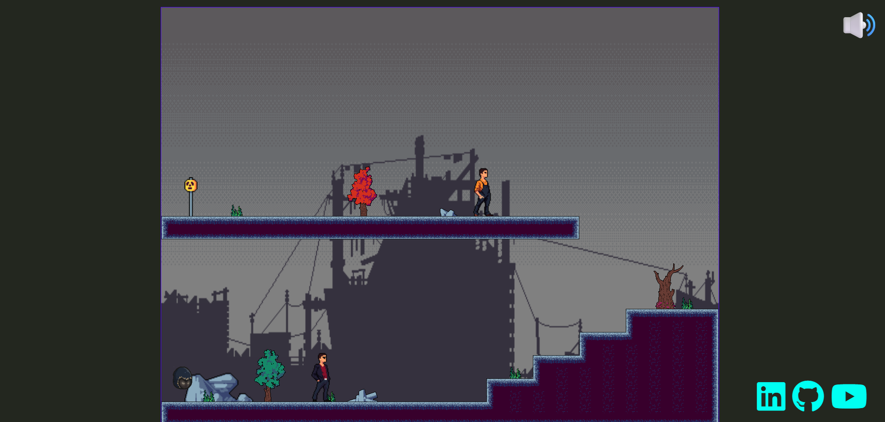
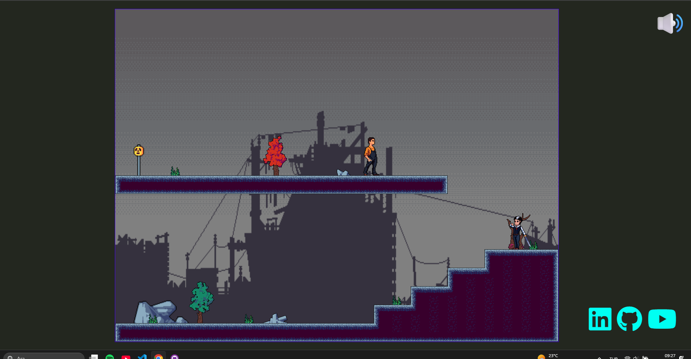
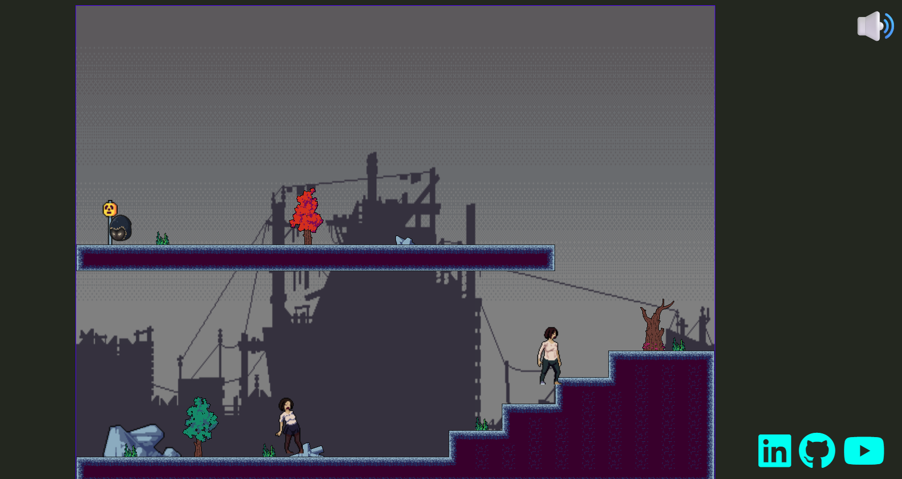

🧛‍♂️ VampirIsBack - Piksel Sanatlı Parkur&Bulmaca Oyunu
VampirIsBack, karanlık bir atmosferde geçen, ruhlar ve lanetli yaratıklarla dolu bir piksel art korku-aksiyon oyunudur. Oyunda, efsanevi bir vampirin ruhu olarak başlıyor, insan bedenlerini ele geçirerek güç topluyor ve ölümsüzlüğe yeniden kavuşmaya çalışıyorsun.

🧠 Oyun Mekanikleri
Oyuncu, vampirin ruh hali ile oyuna başlar. Bu haliyle fiziksel dünyaya müdahale edemez ancak canlıları gözleyebilir.

Mouse sol tık (1. kez): Vampir, seçilen bir insanın bedenini ele geçirir (possession) ve onun yaşam gücünü emer.

Mouse sol tık (2. kez): Ele geçirdiği bedenden ayrılarak tekrar ruh formuna döner.

Ruh halindeyken: Oyuncu tekrar fiziksel form kazanamaz, yeniden bir canlıyı ele geçirmesi gerekir. Ancak bunun için yeterli yaşam gücü olmalıdır.

Yaşam gücü olmadan, vampir ruh formunda sıkışıp kalır. Bu durum oyuncuya stratejik kararlar aldırır.

🕹️ Kontroller
Tuş	İşlev
⬆️ ⬇️ ⬅️ ➡️	Hareket
🖱️ Sol Tık	 Bedenden ayrıl/ Ruh haline dön

🖼️ Kullanılan Assetler & Kaynaklar

CraftPix.net Üzerinden:

Free Exclusion Zone Tileset - Pixel Art

→ Karantina bölgesi zeminleri ve yıkık çevre objeleri
→https://craftpix.net/freebies/free-exclusion-zone-tileset-pixel-art/

Free Chibi Dark Oracle Character Sprites

→ Vampirin ruh formundaki görünümü için

→https://craftpix.net/freebies/free-chibi-dark-oracle-character-sprites/

Free Urban Zombie Sprite Sheet - Pixel Art Pack

→ Canlıların enfekte olduktan sonraki görünüşü

→https://craftpix.net/freebies/free-urban-zombie-sprite-sheet-pixel-art-pack/

Free Vampire Pixel Art Sprite Sheets

→ Vampirin orijinal formu

→https://craftpix.net/freebies/free-vampire-pixel-art-sprite-sheets/

Free Sky With Clouds Background - Pixel Art Set

→ Oyun içi gökyüzü ve arka plan katmanları

→https://craftpix.net/freebies/free-sky-with-clouds-background-pixel-art-set/

Free City Man Pixel Art Character Sprite Sheets

→Oyun içerisindeki canlıların orjinal görünüşleri

→https://craftpix.net/freebies/city-man-pixel-art-character-sprite-sheets/

Diğer Kaynaklar:

Pixabay Müzik ve Ses

→ Atmosferik arka plan müzikleri ve asiyon sesleri

→https://pixabay.com//?utm_source=link-attribution&utm_medium=referral&utm_campaign=music&utm_content=188986

LyokoBlight - Bioweapon (İlham Kaynağı)

→ Stil, atmosfer ve ruh halinden ilham alınan referans proje

→https://lyokoblight.itch.io/bioweapon

### 🎬 Oyun Görselleri

### 🎥 Oyun Tanıtım Videosu
  
⚠️ Lisans ve Kullanım Şartları
Kullanılan tüm içerikler ücretsizdir ancak genellikle kişisel kullanım içindir. 
Ticari kullanımlar için içeriklerin kendi lisans koşulları kontrol edilmelidir. 
Attribution (atıf) gerektiren içeriklerde kaynak bağlantıları eksiksiz şekilde verilmiştir.

